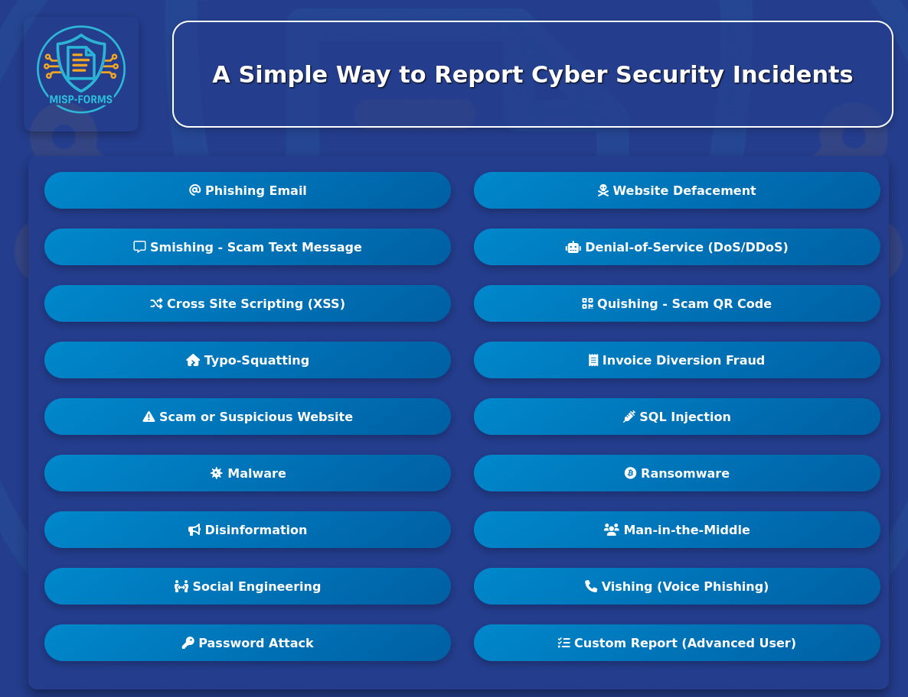

  

## MISP-Forms Overview

**MISP-Forms** is a service designed to provide users with a set of intuitive web forms for reporting various types of cyber attack. 
These forms ensure that all relevant data is accurately captured and structured in a way that makes it actionable for law enforcement 
agencies, national authorities, and organisations such as CSIRTs (Computer Security Incident Response Teams). 


<p align="center">
  
</p>

---

## Key Features

* Delivered through a simple **Python Flask** web application.
* Can interface with any MISP instance
* Each form is tailored to reflect common cyberattack types or vectors.
* Prescriptive input fields help ensure all essential information is collected — even from non-technical users.
* Simplified Sharing and Distribution options.
* Supports TLP, PAP, RSIT, and CIRCL taxonomies.

---

## Technical Details

Submitted data is processed using the the **PyMISP** Python library. Each submission is:

* Mapped to the appropriate **MISP data types**
* Tagged with relevant **taxonomy terms** (TLP, PAP, RSIT, and CIRCL)
* Assigned applicable **Galaxy Clusters**
* Configured with suitable **distribution and sharing settings**

> ⚠️ **Events are not published automatically by default.**
> This supports operational security and prevents the accidental disclosure of sensitive data. It is expected that a system administrator will review and publish events when appropriate.


---

## Installation Guide

MISP-Forms can be deployed in one of three ways:

1. From Source
2. Building Docker image locally
3. Pull the prebuilt Docker image from DockerHub

---

### Create a MISP account for MISP-Forms.

* Create a User Account in MISP
Set up a dedicated user account in MISP. This account will be used by MISP-Forms to submit threat reports.

* Generate an API Key
Log in to MISP using the newly created account and generate an API key.
You will need both the API key and the organisation name associated with this user for the MISP-Forms configuration files.

* Enable Supported Taxonomies
MISP-Forms currently supports the following taxonomies: TLP, PAP, RSIT, and CIRCL.
It is recommended that these taxonomies are enabled on your MISP instance to ensure proper tagging and classification of submitted reports.

---

### Create Config Files
Two config files are required to run MISP-Forms, .env and misp_keys.json

#### .env
Specify the URL for your MISP server and add a Flask Secret Key(aids session security).  

```env
MISP_URL=
MISP_VERIFY_SSL="false"
FLASK_SECRET_KEY=
LOOKYLOO_URL=
FLASK_ENV=production
FLASK_DEBUG=0
MAX_CONTENT_LENGTH_MB=5
LOG_LEVEL=INFO
```

#### misp_keys.json
Create a MISP-Forms user on your misp instance and generate an API key for that user.
In this file add the user's MISP Organisation name and the API key in this file.

```json
{
    "organistion_name": "misp-apikey"
}

```
---

### Deploying MISP-Forms

#### From Source

```bash
git clone https://github.com/UCD-CCI/MISP-Forms.git 
cd MISP-Forms
```

Create your misp_keys.json and .env files

```bash
python3 -m venv venv
. ./venv/bin/activate
pip install -r requirements.txt
gunicorn -w 4 -b 127.0.0.1:5000 app:app
```
---

#### Docker (Build image)

```bash
    git clone https://github.com/UCD-CCI/MISP-Forms.git 
    cd MISP-Forms
```
Create your misp_keys.json and .env files
```bash
docker compose up -d
```
---
#### Docker (pull Image from Docker Hub)

Create your misp_keys.json and .env files

```bash
docker run -d --env-file .env -v $(pwd)/misp_keys.json:/app/misp_keys.json -p 5000:5000 misp-forms:latest
```
---

### Connecting to MISP-Forms

Connect to MISP-Forms via browser
  
http://127.0.0.1:5000

or 

http://{ip address or domain name}:5000

---

### ⚠️ SECURITY WARNING: **Deploy within access-controlled environments only**   

> MISP-Forms is intended for use within access-controlled environments, such as local area networks (LANs) or internal infrastructure. This version does not include built-in user authentication and should not be exposed directly to the public internet.    
> If internet exposure is required, it is strongly recommended to place MISP-Forms behind a reverse proxy or gateway that provides authentication (e.g. using solutions like Keycloak, LDAP, or HTTP basic auth).
